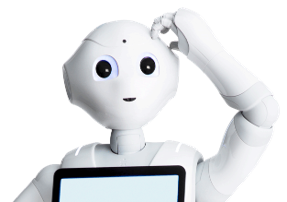

# AI Robot To-Do Assistant 

## Overview

  

The goal of this project is to develop a robotic assistant for helping people in managing their personal to-do lists using the spoken natural language. The robot used, Pepper, has to manage multiple users and recognize them from face or voice.
Obviously, the system was designed with the aim of being user-friendly, portable with a high level of modularity and portability and with good performance in terms of speech recognition and interaction. 

## Some Guidelines
- The distance between the user and the robot must be less than 2 meters.
- No ambient noises during the conversation.
- Only one person at a time can interact with the robot.
- Conversations can occur in both English and Italian.

## Developed System
To realise such a system, first of all a **ROS Dialogue System** was developed using **RASA** that was capable of interacting with the user through written text to enter new activities to be performed, modify existing activities or remove previous ones, to consult one's own activities, to manage different categories of activities if necessary, and to manage different users. Such a chatbot was realised ensuring good performance and ease of use by the user, but also security for the users' information stored. This chatbot was realized through the definition of a nlu and a pipeline composed of a pre-trained model for Italian linguage, tokenizer, featurizer, DIETClassifier, duckling entity extractor, etc.
To realise the entire system it was necessary to integrate this developed RASA system with other ROS packages, in order to achieve decoupling and independence, as reported in the architecture diagram. 

  

The user's voice commands are translated into written text, interpreted by the RASA chatbot, which provides a response then addressed to the user, as part of the conversational flow. Allowing the management of multiple users, in order to particularise their experience and guarantee privacy, a mechanism for recognising each user through both, their face and their voice, has been implemented. Finally, through the use of the tablet, the user experience was enriched through the visual component.
Both recognition procedures were carried out through the use of neural networks for feature extraction and cosine distance to assess the probability of belonging to one of the registered users. Both tools were used for the re-identification process, weighted differently according to their reliability, so as to minimize errors arising from possible alterations. If the user is not recognized as an already registered one, he or she is given the opportunity to register, after collecting audio and video samples. In addition, for registered users, in order to improve speech recognition performance, a continuous learning mechanism was set up, such that more samples were added to the database as users interacted.

All te information about users and their activities are stored within a carefully designed sqlite database, translating in the relational schema the initial E-R schema. On that database it is possible to interact through custom actions.

The entire system built has obviously undergone unit and integration tests to ascertain its actual effectiveness.

For more information on the architecture of the developed system, of the different nodes, of the interactions between them and of the conducted tests, click [here](https://github.com/CamillaSpi/DefinitivoCog/blob/main/ReportCRFinaleCognitive.pdf).

## Repository Structure
- `./catkin_tools/`: contains persistent configuration information used by catkin command and its sub-commands;
- `src/`: different nodes implementing all the functionalities;
- `videoFromPepper/`: contains different videos of the registered users so far;
- `webPage/`: contains all the codes useful for the web page showed on paper tablet representing another interaction way with the user, through which it is possible to see a real-time update of saved activities;
- `FinalPresentationCognitiveRobotics.pptx` and `ReportCRFinaleCognitive.pdf`: are the presentation and the report respectively, containing information on the architecture of the developed system, of the different nodes, of the interactions between them and of the conducted tests.

## DEMO
[Here](https://www.youtube.com/watch?v=NIoZ4qSGSHk) it is possible to see a demo video of the developed system on the Pepper robot and all the implemented features.

## Feedback
For any feedback, questions or inquiries, please contact the project maintainers listed in the Contributors section.
